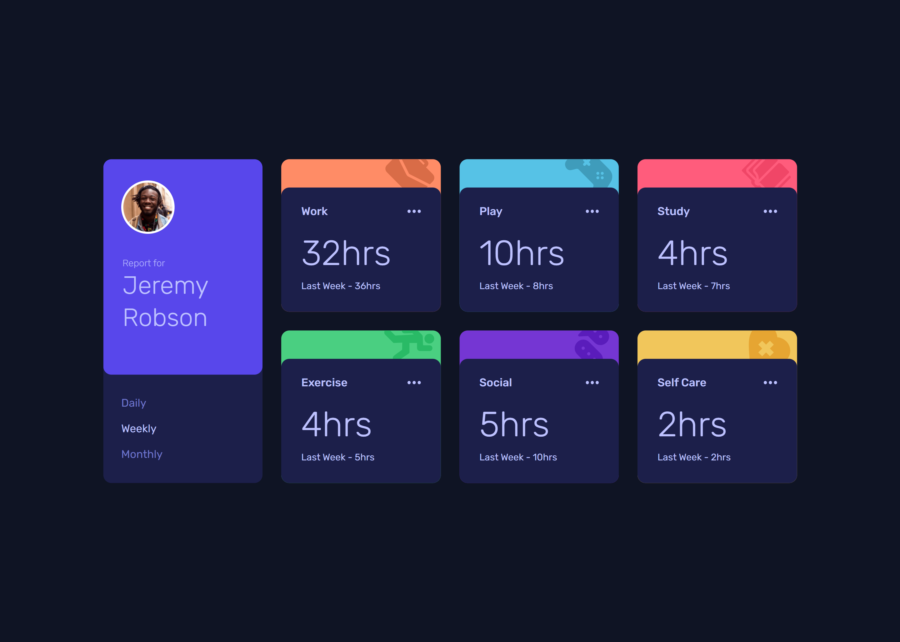

# Frontend Mentor - Time tracking dashboard solution

This is a solution to the [Time tracking dashboard challenge on Frontend Mentor](https://www.frontendmentor.io/challenges/time-tracking-dashboard-UIQ7167Jw).

## Table of contents

- [Frontend Mentor - Time tracking dashboard solution](#frontend-mentor---time-tracking-dashboard-solution)
  - [Table of contents](#table-of-contents)
  - [Overview](#overview)
    - [The challenge](#the-challenge)
    - [Screenshot](#screenshot)
    - [Links](#links)
  - [My process](#my-process)
    - [Built with](#built-with)
    - [What I learned](#what-i-learned)
      - [Javascript](#javascript)
      - [Typescript](#typescript)
      - [SASS/SCSS](#sassscss)
      - [Vue](#vue)
  - [Project setup](#project-setup)
    - [Clone the repo locally](#clone-the-repo-locally)
    - [Install dependencies](#install-dependencies)
    - [Compiles and hot-reloads for development](#compiles-and-hot-reloads-for-development)
    - [Compiles and minifies for production](#compiles-and-minifies-for-production)
    - [Recommended IDE Setup](#recommended-ide-setup)
  - [Continued development](#continued-development)
  - [Useful resources](#useful-resources)
  - [Author](#author)

## Overview

### The challenge

Users should be able to:

- View the optimal layout for the site depending on their device's screen size
- See hover states for all interactive elements on the page
- Switch between viewing Daily, Weekly, and Monthly stats

### Screenshot



### Links

- Solution URL: [Add solution URL here](https://your-solution-url.com)
- [Live Site](https://time-tracking-dashboard.vercel.app)

## My process

### Built with

- CSS custom properties
- Flexbox
- CSS Grid
- Mobile-first workflow
- [Pug](https://pugjs.org/) - HTML preprocessor
- [Sass/Scss](https://sass-lang.com) - CSS preprocessor
- [Vue3](https://v3.vuejs.org/) - JS framework
- [Typescript](https://www.typescriptlang.org) - JS Preprocessor
- [Vite](https://vitejs.dev/) - Build tool

### What I learned

#### Javascript

- To get the number of the children of an element, `childElementCount` property can be used.

```html
<ul>
  <li>item 1</li>
  <li>item 2</li>
  <li>item 3</li>
</ul>
```

```js
const ulElement = document.querySelector("ul");
console.log(ul.childElementCount); //  3
```

#### Typescript

- To create an interface/type that have another interface's types and some additional types, `extends` can be used

```ts
interface X {
  name: string;
}

interface Y extends X {
  age: number;
}

// interface Y will be equivalent to:
interface XY {
  name: string;
  age: number;
}
```

- For this same purpose, type aliases with intersection(&) can be used as well.

```ts
type Y = X & { age: number };
```

#### SASS/SCSS

- If there are no parameters in a sass mixin, the parentheses can be omitted.

<!-- prettier-ignore -->
```scss
@mixin foo() {
  // ...
}

@mixin foo { // 👈 no parentheses
  // ...
}

@include foo; // it can be omitted when calling the mixin too
```

#### Vue

- Composition api `setup()` function can be used as a separate script tag. [doc][2]

```vue
<script>
import { ref } from "@vue";
import VComponent from "./components/VComponent.vue"

export default {
  components: {
    VComponent
  }
  setup() {
    const x = ref(0);
    return { x };
  },
};
</script>

<template>
  <VComponent>{{ x }}</VComponent>
</template>
```

👆 This can be written like this 👇

```vue
<script setup>
import VComponent from "./components/VComponent.vue"
import { ref } from "@vue";

const x = ref(0);
</script>

<template>
  <VComponent>{{ x }}</VComponent>
</template>
```

`<script setup>` can be used alongside normal `<script>`

- Ref sugar (currently it is an experimental feature) [proposal][3]

<!-- prettier-ignore -->
```js
import { ref } from 'vue'

const x = ref(0)
const y = () => x.value + 1
```

With `$ref`, the code above can be shorten to this:

<!-- prettier-ignore -->
```js
let x = $ref(0)
const y = () => x + 1
```

Basically, it eliminates the need to use `.value` when using `refs`.
And since it's a compiler macro, it doesn't need to be imported.

## Project setup

### Clone the repo locally

```
git clone https://github.com/FarisPalayi/time-tracking-dashboard.git
```

### Install dependencies

```
yarn
```

### Compiles and hot-reloads for development

```
yarn dev
```

### Compiles and minifies for production

```
yarn build
```

### Recommended IDE Setup

- [VSCode](https://code.visualstudio.com/) + [Volar](https://marketplace.visualstudio.com/items?itemName=johnsoncodehk.volar)

## Continued development

I find that when writing asynchronous code with the composition api, I'm running into a lot of problems. So, my next focus will be to read the composition api docs well. And I'm also planning to create some vanilla js, typescript projects.

## Useful resources

- [Vue 3 docs][1] - Vue's official doc
- [SFC `<script setup>`][2] - api reference page
- [Ref sugar][3] - Ref sugar proposal

[1]: https://v3.vuejs.org/
[2]: https://v3.vuejs.org/api/sfc-script-setup.html#sfc-script-setup
[3]: https://github.com/vuejs/rfcs/discussions/369

## Author

- Frontend Mentor - [@farispalayi](https://www.frontendmentor.io/profile/farispalayi)
- Twitter - [@farispalayi](https://www.twitter.com/farispalayi)
